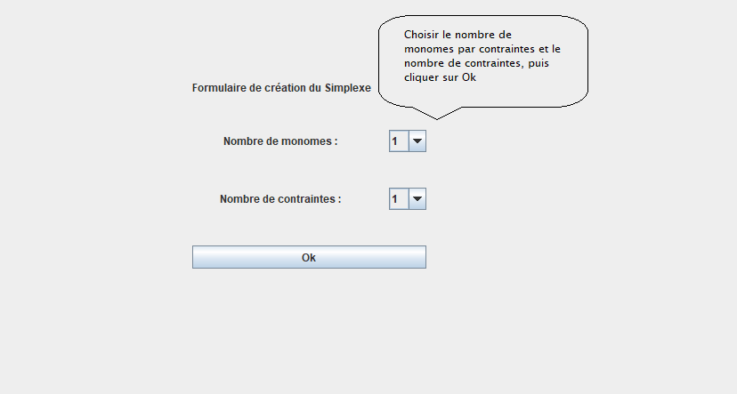
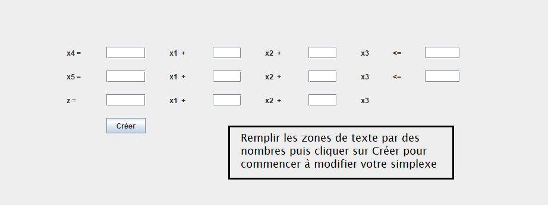
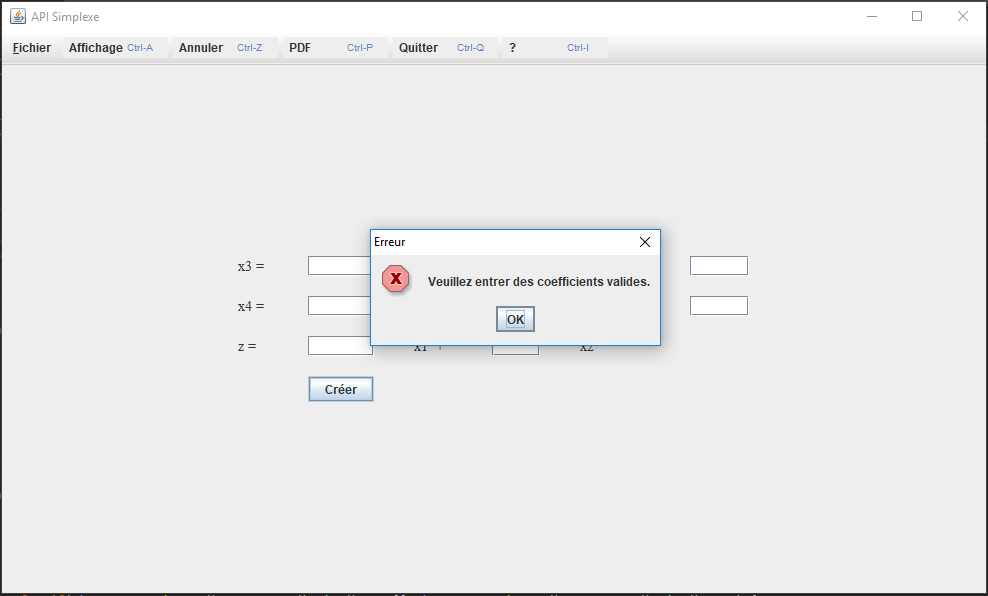
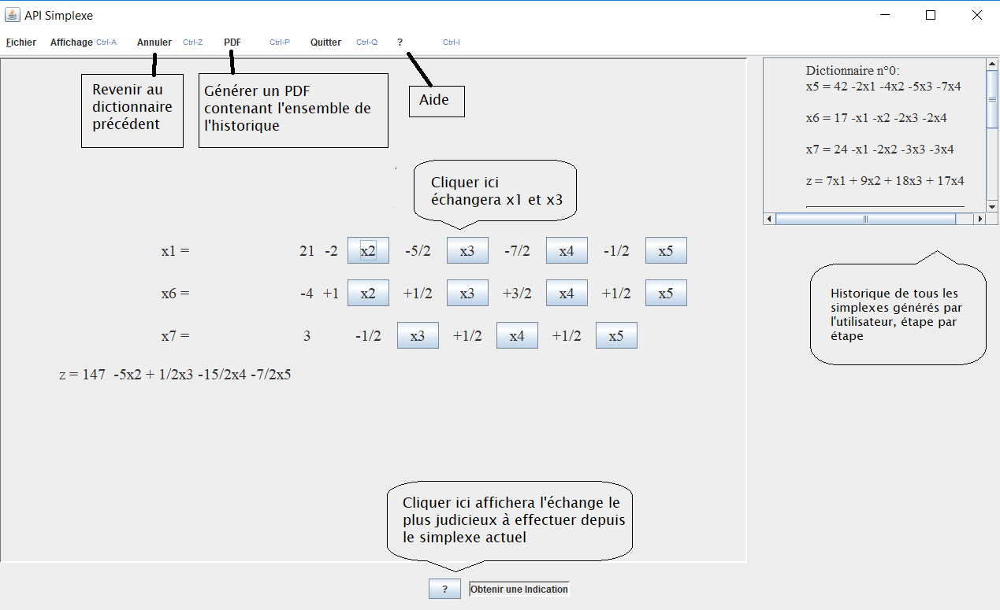
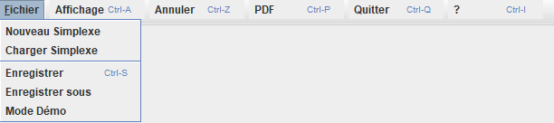
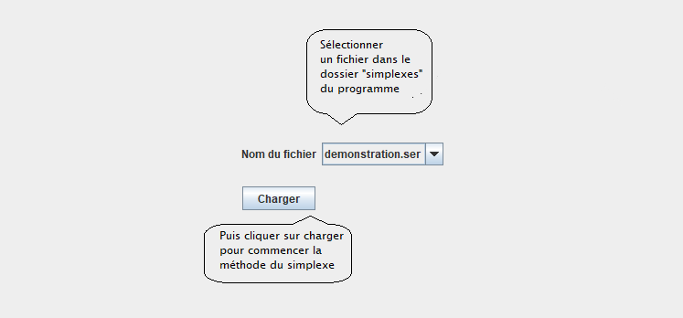

# Manuel utilisateur

## Introduction
Ceci est le **manuel utilisateur** de l'API Simplexe. Vous y trouverez toutes les informations qu'il vous faut pour bien utiliser cette API.

## De la création à la résolution
### Création d'un simplexe
Le premier écran de l'API est un panel où l'utilisateur choisit le nombre de _contraintes_ et le nombre de _monomes_ des contraintes. Cela se fait en sélectionnant les valeurs dans les listes déroulantes.

> Figure 1 : Premier panel de création d'un simplexe --- Choix du nombre de monomes et de contraintes

Une fois les valeurs sélectionnées, l'utilisateur peut appuyer sur le bouton **OK**.

Après avoir appuyé sur **OK**, un autre panel s'affiche. Ce nouveau panel contient le nombre exact de champ nécessaire pour que l'utilisateur puisse saisir les valeurs de chaque monome.

> Figure 2 : Deuxième panel de création d'un simplexe --- Saisie des monomes

Si les valeurs saisies ne sont pas des nombres ou si un ou plusieurs champs sont laissés vides, une fenêtre d'erreur s'affichera.

> Figure 3 : Deuxième panel de création d'un simplexe --- Fenêtre d'erreur

Une fois que tous les champs ont une valeur valide, l'utilisateur peut appuyer sur le bouton **Créer**.

### Effectuer le calcul
Maintenant que le simplexe est créé, un nouveau panel s'affiche. Ce panel affiche les **contraintes explicites** du simplexe créé ainsi que sa **fonction économique** dans un cadre dans la partie gauche de la fenêtre. Les variables potientiellement échangeables apparaissent dans le simplexe sous forme de **bouton**.

> Figure 4 : Panel affichant le simplexe et ses boutons

Pour **échanger** une variable, il suffit d'appuyer sur un bouton. Le simplexe sera alors mis à jour avec la variable que vous avez sélectionnée apparaissant _dans la base_ et la variable de la contrainte apparaissant _hors base_.

Si l'utilisateur a besoin de savoir qu'elle serait l'échange le plus judicieux à faire, il peut appuyer sur le bouton se situant dans la partie sud de la fenêtre. Ce bouton, marqué d'un point d'interrogation (**?**) permet d'afficher un indice dans le cadre se situant à sa droite. Si ce cadre indique _"Vous avez atteint le bénéfice maximum"_, alors c'est que vous avez résolu le simplexe et que vous n'obitendrez pas de meilleur résultat.

## La barre de menu
### L'onglet "Fichier"

> Figure 5 : Barre de menu --- Le menu _Fichier_ est ouvert

#### Nouveau simplexe
Comme on peut le voir dans la figure ci-dessus, on peut créer un nouveau simplexe en appuyant sur ce bouton. Il affichera directement le panel de la **figure 1**.

#### Charger simplexe

> Figure 6 : Le panel de chargement des simplexes

On peut charger un simplexe en appuyant sur le bouton _"Charger simplexe"_. Cela affiche le panel de la figure ci-dessus. L'utilisateur n'a plus qu'à sélectionner le fichier qu'il veut charger et appuyer sur le bouton en-dessous. 
Le panel de la **figure 4** va alors s'afficher avec le dernier dictionnaire effectué.

#### Enregistrer, enregistrer sous
En appuyant sur _"Enregistrer"_, l'utilisateur peut sauvegarder son simplexe dans un fichier, ce dernier pouvant être chargé plus tard.

#### Mode Démo
Ce bouton permet d'ouvrir le mode _démo_. Ce mode permet à l'utilisateur de voir comment utiliser l'API pendant qu'il utilise l'API, dans le cas où il aurait du mal.

#### Affichage
Ce bouton a pour seule utilité d'afficher le panel principal de l'API, celui de la **figure 4**, contenant le simplexe, son historique et le panel contenant les indications.

#### Annuler
Ce bouton, comme son nom l'indique, permet d'annuler la dernière action mené sur le simplexe. Cela effacera aussi le dernier dictionnaire de l'historique.

#### PDF
Ce bouton permet d'exporter vos dictionnaires dans un fichier au format **PDF**. _Il n'est pas possible de créer un fichier PDF sans avoir créé un simplexe au préalable_.

#### Quitter
Le bouton _"Quitter"_ permet de quitter l'API.

#### Aide (**?**)
Ce bouton ouvre une petite fenêtre indiquant de manière succinte ce que l'API peut faire et à quoi elle sert.